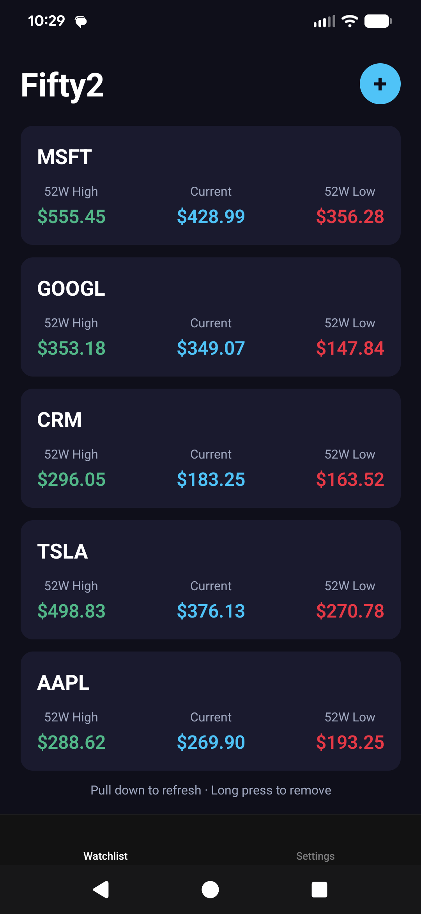

# Fifty2

A stock tracking app for Android and iPhone that displays the 52-week high, 
current price, and 52-week low for user-selected stocks. Users receive push 
notifications when a stock hits its 52-week high or low.

Built by a non-developer using AI-assisted development — zero prior coding 
experience. Currently in closed alpha testing on Google Play.

---

## What It Does

- Track up to 20 stocks on a personal watchlist
- Live price data with pull-to-refresh
- Push notifications when any stock hits its 52-week high or low
- 24-hour duplicate notification prevention per symbol
- Persistent watchlist across sessions

## Tech Stack

- React Native with Expo SDK 54
- TypeScript
- Supabase (PostgreSQL + Edge Functions + pgcron)
- Twelve Data API for live stock prices
- Expo Push Notifications
- EAS Build (Google Play closed alpha)

## Architecture

- Device identity via UUID stored in expo-secure-store
- Hourly price checks via Supabase Edge Function + pg_cron
- Push notifications sent via Expo push service when within 1% of 52W high/low
- RLS enabled on all Supabase tables — rows restricted by device_id

## Security

This app uses the Supabase anon key in the client, which is intentional and 
standard practice for React Native apps. The anon key is a public-facing 
credential designed to be included in client applications. It does not grant 
privileged access. Security is enforced through:

- Row Level Security (RLS) on all three database tables
- Device-scoped data access — each device can only read/write its own rows
- Input validation on stock symbols (regex enforced)
- Watchlist cap of 20 stocks per device
- Edge Function protected with x-cron-secret header
- Sanitized error messages — no internal details exposed

## Status

- Google Play closed alpha — 13 testers active as of April 2026
- Phase 5 in progress: color theme update, Apple App Store pending Mac purchase

## About

Built as a solo project to learn AI-assisted mobile development. Every line 
of code was written in collaboration with Claude. The project demonstrates 
what's possible when domain knowledge and AI capability combine — shipping 
a production-grade app with no prior coding background.
